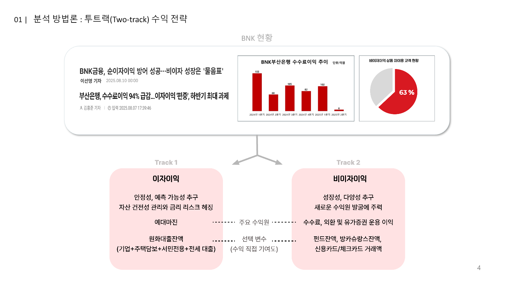
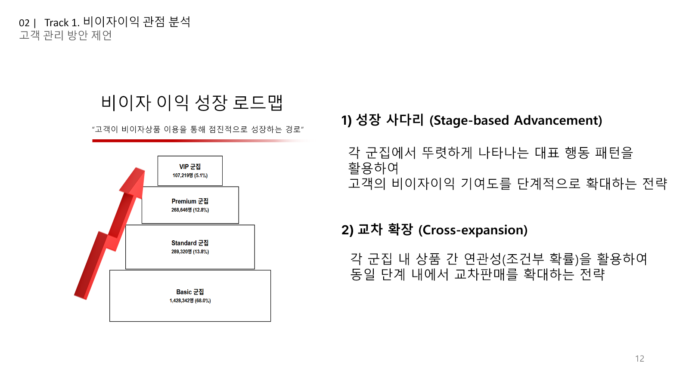
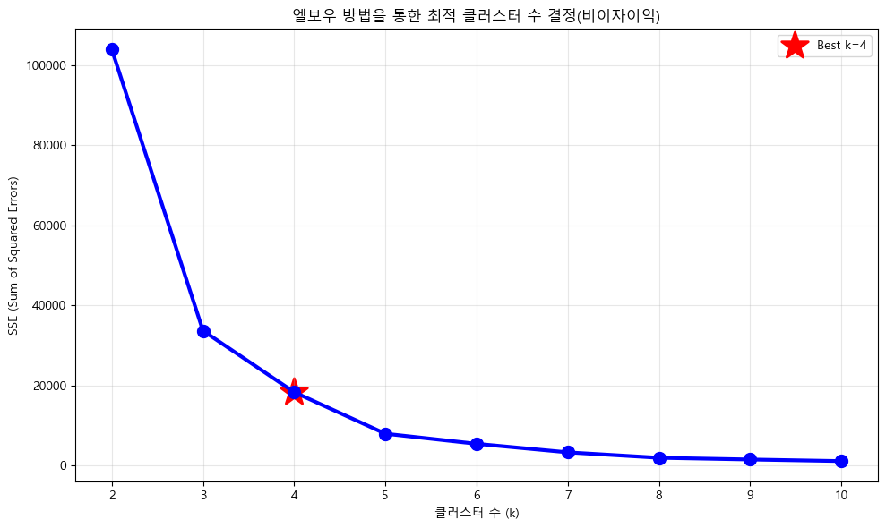
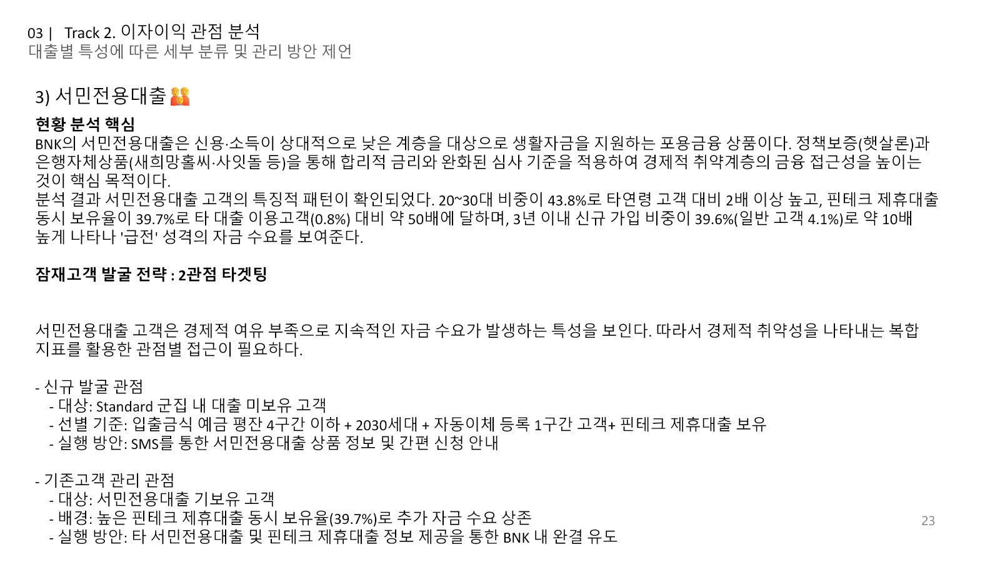

# BNK 고객 세분화 프로젝트

<p align="center">2025 DIVE 글로벌 데이터 해커톤 · 4인 팀 · 24시간 · BNK부산은행 발제사 3등</p>

<p align="center">
  
  
  
  
  
</p>

> 거래 유형별 BNK 고객을 세분화하고, **이자이익의 안정성**과 **비이자이익의 성장성**을 분리해 고객 관리 전략으로 연결한 데이터 해커톤 프로젝트입니다.

## 프로젝트 한눈에 보기

| 항목 | 내용 |
| --- | --- |
| 프로젝트명 | 데이터 기반 고객 유형별 분류와 관리 방안의 제언 |
| 진행 시점 | 2025년 8월 |
| 대회 | DIVE 글로벌 데이터 해커톤 |
| 주최 · 발제사 | 부산테크노파크 · BNK부산은행 |
| 형태 · 결과 | 4인 팀 · 24시간 해커톤 · 발제사 3등 |
| 핵심 산출 | Two-track 분석 프레임, 고객 성장 로드맵, 상품별 대출 타깃 전략 |

## 문제 정의: 고객 분류가 아니라 수익 구조를 푸는 일

주어진 과제는 “거래 유형별로 BNK 고객을 분류하고 관리 방안을 제언하라”는 것이었습니다. 그러나 팀은 곧바로 모든 거래 변수를 하나의 군집 모델에 넣지 않았습니다. 그렇게 하면 고객이 **왜** 중요한지, 그리고 **무엇을 해야 하는지**가 흐려진다고 보았기 때문입니다.

### 우리가 바꾼 질문

| 단순한 출발점 | 이 프로젝트의 출발점 |
| --- | --- |
| 고객을 몇 개의 군집으로 나눌 것인가? | 은행이 해결해야 할 수익 문제는 무엇인가? |
| 모든 거래 변수를 한 모델에 넣을 것인가? | 수익 목표별로 어떤 변수와 해석 기준이 필요한가? |
| 군집의 특징은 무엇인가? | 각 고객에게 어떤 관리·확장 전략을 제안할 수 있는가? |

그 결과 분석의 중심 질문을 아래 두 가지로 재정의했습니다.

1. 어떤 고객이 안정적인 이자이익에 기여하는가?
2. 어떤 고객이 비이자이익 확장의 잠재력이 큰가?

비이자이익은 단순히 고기여 고객을 찾는 문제가 아니라, 기존 고객의 거래 관계를 어떻게 확장할지에 대한 문제로 보았습니다. 공개본에는 원본 고객 데이터를 포함하지 않으며, 공개 가능한 결과 수치와 전략의 근거는 [발표 슬라이드 출처](docs/presentation-assets.md)와 [결과 및 전략](docs/results.md)에서 확인할 수 있습니다.

## 접근 방향: 수익 목표에 따라 분석 축을 분리

고객의 행동·활용 상품·관리 목표가 두 수익원에서 다르기 때문에, 하나의 고객 점수나 하나의 군집 체계로 모든 문제를 설명하지 않았습니다. 대신 **이자이익은 안정성**, **비이자이익은 성장성**이라는 각기 다른 목표에서 출발한 Two-track 분석 프레임을 설계했습니다.

이 구분은 설명을 위한 사후 분류가 아니었습니다. **프로젝트 내부 회의록에 남은 사전 분석 기록**에서 원화대출잔액과 신용·체크카드 거래액의 스피어만 상관계수는 각각 `-0.3338`, `-0.3756`이었고, 비이자수익 평균과 이자수익의 상관계수는 `-0.4943`이었습니다. 이 기록을 근거로 두 수익원이 동일한 고객 행동만으로 설명되지 않는다고 판단해, 이자와 비이자를 분리하여 고객 특성과 실행 전략을 해석했습니다. 원본 상관표는 공개하지 않으며, 지표의 의미와 검증 가능한 범위는 [분석 방법](docs/analysis-method.md)과 [모델 근거와 검증 범위](docs/model-validation.md)에서 확인할 수 있습니다.

| 트랙 | 사업 질문 | 분석 변수 | 결과물 |
| --- | --- | --- | --- |
| 이자이익 | 안정적 수익에 기여하는 고객과 상품별 잠재 타깃은 누구인가? | 원화대출잔액, 대출 상품군, 고객 프로필 | 상품별 잠재고객·생애주기 관리 방향 |
| 비이자이익 | 비이자상품을 확장할 수 있는 고객과 경로는 무엇인가? | 펀드·방카슈랑스 잔액, 신용·체크카드 거래 | 고객 성장 사다리·교차 확장 전략 |

예금은 자금조달에는 중요하지만, 이 프로젝트의 핵심 질문인 `수익 구조 다변화`에 대한 직접성이 낮아 핵심 세분화 변수에서는 제외했습니다. 이것은 데이터를 버린 것이 아니라, **문제 정의에 맞게 변수의 역할을 분리한 결정**입니다.

<p align="center">
  
</p>
<p align="center"><sub>실제 최종 발표자료 4쪽. 이 저장소의 이미지는 기존 발표자료 또는 실제 분석 노트북 출력에서 추출했으며, 별도로 생성한 이미지는 사용하지 않았습니다.</sub></p>

## 데이터: 왜 전처리가 분석의 출발점이었나

대회 제공 데이터 명세를 기준으로 고객 데이터는 **41개 필드**로 구성되어 있었습니다. 고객의 인구통계·가입 기간·디지털 채널 이용·예금·대출·펀드·방카슈랑스·카드 거래를 함께 담고 있었지만, 금액과 이용 횟수는 개인정보 보호를 위해 원시 수치가 아닌 `0~9구간` 형태로 제공되었습니다. 일부 최상위 구간은 상한이 없는 개방구간이었습니다.

| 데이터 제약 | 전처리 판단 | 포트폴리오에서 보여주는 역량 |
| --- | --- | --- |
| 원시 수치 대신 구간값 제공 | 일반 구간은 대표값으로, 개방구간은 분포를 고려해 대표값 추정 | 불완전한 데이터의 분석 가능성 설계 |
| 다양한 수익 관련 변수가 혼재 | 수익 목표별로 이자·비이자 트랙을 분리 | 변수 나열이 아닌 문제 중심의 모델 설계 |
| 고객 단위 금융 데이터 | 원본·파생 데이터는 비공개, 코드·집계 결과·발표자료만 공개 | 데이터 보안과 포트폴리오 공개 경계 관리 |

대표값 치환은 원시값을 복원하는 방법이 아니라, 군집 간의 **상대적 패턴을 일관되게 비교하기 위한 분석 가정**입니다. 이 가정과 구현 근거는 [분석 방법](docs/analysis-method.md)과 [전처리·군집화 노트북](notebooks/1.전처리_및_군집화.ipynb)에서 확인할 수 있습니다.

## 핵심 결과

### 1. 비이자이익: 고객을 성장 경로로 해석

비이자이익 군집은 단순 우열이 아니라 `Basic → Standard → Premium → VIP`의 고객 성장 경로로 해석했습니다. [최종 발표자료 12쪽](docs/presentation-assets.md)의 분포 기준 각 군집은 Basic <strong>1,428,342명(68.0%)</strong>, Standard <strong>289,320명(13.8%)</strong>, Premium <strong>268,646명(12.8%)</strong>, VIP <strong>107,219명(5.1%)</strong>으로 정리했습니다.

<p align="center">
  
</p>
<p align="center"><sub>실제 최종 발표자료 12쪽. 군집 규모와 성장 사다리·교차 확장 전략을 함께 제시했습니다.</sub></p>

#### 왜 4개 군집인가

비이자이익 K-Means는 당시 분석 노트북에 저장된 elbow 결과에서 `k=4`를 선택했습니다. 아래 그림은 원본 데이터를 다시 실행해 만든 이미지가 아니라, [공개 노트북](notebooks/1.전처리_및_군집화.ipynb)에 이미 저장되어 있던 실제 출력입니다. 이 근거는 당시의 선택 과정을 보여주며, silhouette·안정성 검증까지 완료했다는 의미는 아닙니다.

<p align="center">
  
</p>
<p align="center"><sub>원본과 한계는 <a href="docs/presentation-assets.md">시각 자료 출처</a>, <a href="docs/model-validation.md">모델 근거와 검증 범위</a>에서 확인할 수 있습니다.</sub></p>

- **성장 사다리**: 군집별 대표 행동을 기준으로 다음 단계의 비이자상품 진입을 설계
- **교차 확장**: 같은 군집 안의 상품 연관성(조건부 확률)을 활용해 거래 범위를 확장
- **VIP 유지**: 신규 판매보다 관계 유지와 맞춤 관리를 우선

### 2. 이자이익: 대출 상품별 잠재고객을 분리

대출은 잔액 총량보다 상품군별 고객 특성이 다르게 나타났습니다. 예를 들어 최종 발표자료에서 서민전용대출 고객은 20~30대 비중, 핀테크 제휴대출 동시 보유, 신규 가입 기간에서 구분되는 패턴을 보였고, 이를 신규 발굴과 기존 고객 관리의 두 관점으로 제안했습니다.

<p align="center">
  
</p>
<p align="center"><sub>실제 최종 발표자료 23쪽. 상품별 고객 프로필을 실행 가능한 타깃 기준으로 정리한 예시입니다.</sub></p>

## 담당 범위

**데이터 전처리 및 모델링**을 맡았습니다. 구간형 데이터를 분석 가능한 수치 데이터로 변환하고, 가계대출이 `0구간`인데 세부 주택담보대출이 `0구간`이 아닌 경우처럼 분석을 왜곡할 수 있는 값의 정합성을 점검했습니다.

- 0~9구간 금융 데이터를 대표값으로 변환하고, 개방형 9구간은 분포·파레토 평균 추정 후보를 비교
- 대출 총액과 세부 상품 구간의 모순을 점검·정제
- 이자·비이자 수익 축을 분리한 K-Means 기반 고객 군집화
- 모델 결과가 이후 비이자이익 성장 전략과 대출 타깃 분석으로 연결될 수 있도록 분석용 데이터셋 정리

즉, 개인정보 보호형 구간 데이터를 바로 해석하는 대신, 재현 가능한 전처리 규칙과 K-Means 모델 입력으로 바꾸어 **전략 제안이 가능한 고객 세분화의 기반**을 만들었습니다. 이 역할과 팀별 분담은 실제 최종 발표자료 2쪽을 기준으로 정리했습니다.

| 이름 | 담당 |
| --- | --- |
| 서호영 (팀장) | 비이자이익 EDA·세부 분석 및 성장 로드맵 |
| **박민규** | **데이터 전처리·모델링** |
| 이정훈 | 이자이익 EDA·세부 분석 및 관리 방향 |
| 장지원 | 시각화·전략 제언 |

## 산출물과 읽는 순서

1. [분석 방법](docs/analysis-method.md) — Two-track 구조와 구간형 데이터 처리 원칙
2. [모델 근거와 검증 범위](docs/model-validation.md) — 공개본에서 확인 가능한 근거와 확인 불가 범위
3. [결과 및 전략](docs/results.md) — 군집·상품별 해석과 제안
4. [실행·평가 설계](docs/execution-measurement.md) — 성과를 꾸미지 않고, 후속 검증의 기준을 정의한 문서
5. [최종 발표자료](docs/IBA_서호영.pptx) — 원본 최종 발표 산출물
6. [README 시각 자료 출처](docs/presentation-assets.md) — 실제 슬라이드·노트북 출력의 원본 위치
7. [노트북 안내](notebooks/README.md) — 코드 흐름과 실행 전제

역할과 배경을 한 문서로 확인하려면 [프로젝트 요약](docs/project-summary.md)을, 최종 요약본과 보고서를 확인하려면 [요약본](docs/IBA_서호영_요약본.docx)과 [인사이트 보고서](docs/인사이트보고서_IBA_최종.docx)를 참고하세요.

## 기술 구성

| 기술 | 사용 목적 |
| --- | --- |
| Python · pandas · NumPy | 구간형 고객 데이터 변환과 분석용 데이터셋 구성 |
| scikit-learn | K-Means 군집화와 표준화 |
| Matplotlib · Seaborn | 군집 패턴과 상품별 특징 확인 |
| Jupyter Notebook | 해커톤 분석 과정과 결과 검토 |

의존성은 [requirements.txt](requirements.txt)에 있습니다.

## 재현 범위와 공개 기준

금융 고객 원본 데이터와 일부 대회 자료는 재배포 권한·공개 적절성이 확인되지 않아 저장소에 포함하지 않았습니다. 따라서 이 저장소는 **원본 데이터까지 포함한 완전 재실행형 저장소가 아니라, 실제 제출물의 분석 구조·코드·해석을 검토하는 포트폴리오형 저장소**입니다.

- 원본 데이터와 정확한 실행 전제: [재현 가이드](docs/reproducibility.md)
- 데이터 비공개 기준: [data/README.md](data/README.md)
- 이미지의 실제 산출물 출처: [README 시각 자료 출처](docs/presentation-assets.md)
- 코드·발표자료의 이용 기준: [이용 및 공개 범위](docs/usage.md)
- 공개 전 점검: `python scripts/verify_portfolio.py`

## 저장소 구성

```text
.
|-- assets/                    # 실제 최종 발표자료·분석 노트북에서 추출한 README 이미지
|-- data/                     # 비공개 데이터의 공개 기준 안내
|-- docs/                     # 분석·결과·재현 문서와 최종 발표자료
|-- notebooks/                # 전처리, 비이자이익, 이자이익 분석 노트북
|-- scripts/verify_portfolio.py
|-- README.md
`-- requirements.txt
```

## 이용 안내

이 저장소는 포트폴리오·학습 기록 열람을 위해 공개합니다. 코드·문서·이미지의 재사용, 수정, 배포는 사전 문의가 필요합니다.
